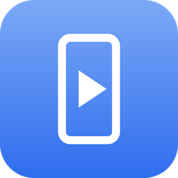
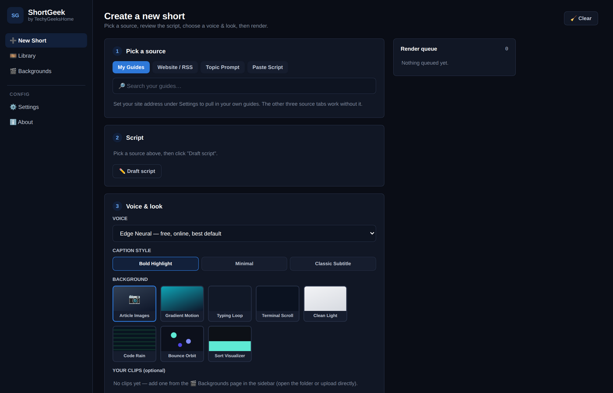
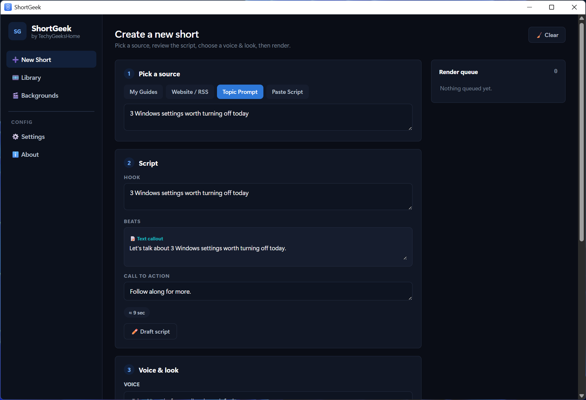
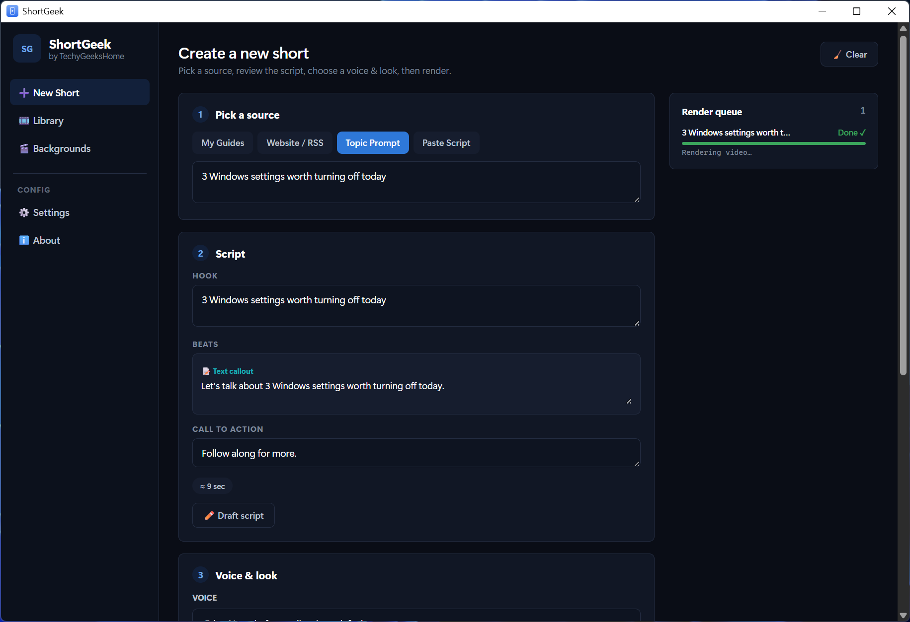
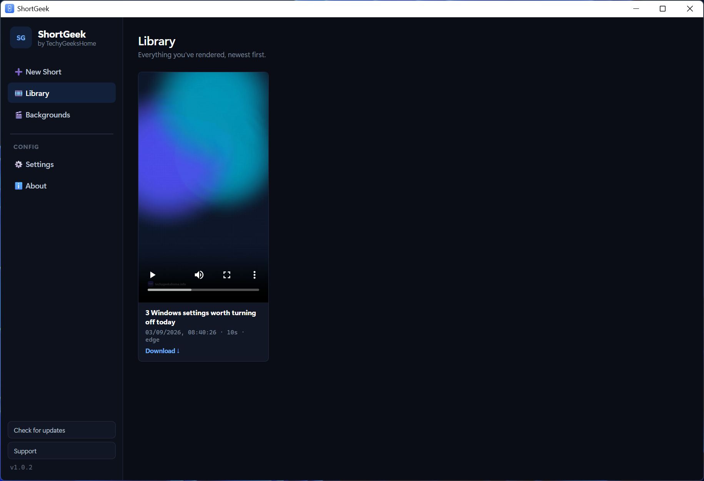
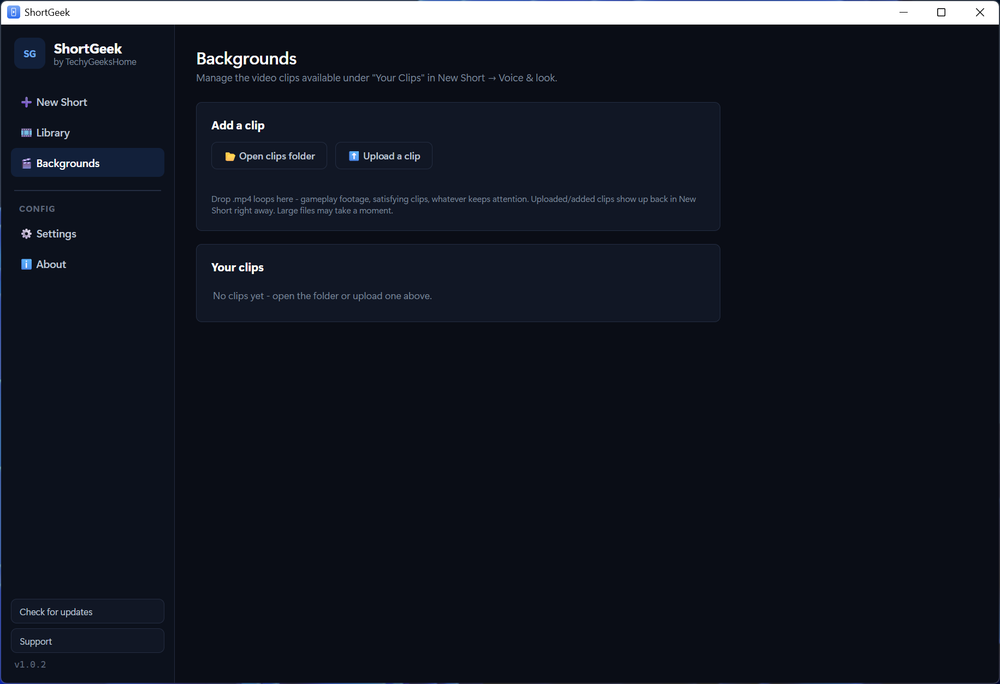
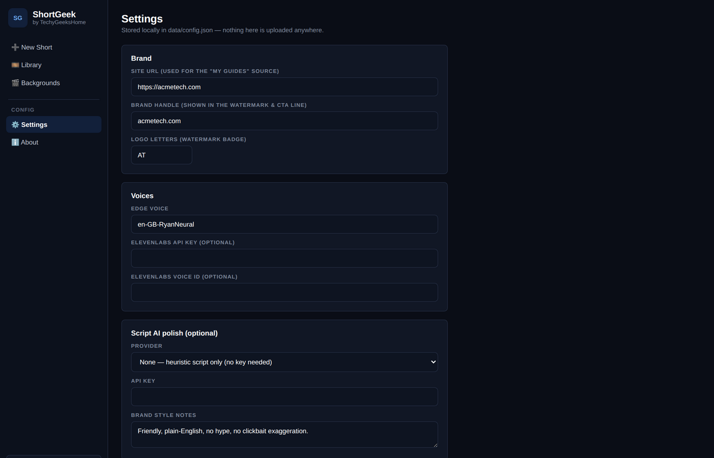

<div align="center">



# ShortGeek

**Turn a guide, an RSS feed or a bare idea into a narrated, captioned vertical short. Rendered on your own machine.**

[](https://github.com/techygeekshome/ShortGeek/actions/workflows/build-windows.yml)
[](https://github.com/techygeekshome/ShortGeek/releases)
[](#download)
[](LICENSE)
[](https://techygeekshome.info)
[](https://ko-fi.com/techygeekshome)

[Download](#download) · [What it does](#what-it-does) · [Where the pictures come from](#where-the-pictures-come-from) · [Voices](#voices) · [Requirements](#requirements)

</div>

---

Point ShortGeek at one of your own articles, any RSS feed or article URL, or just a one line idea.
It drafts a script, narrates it, burns in word by word captions, and renders a 1080x1920 MP4 ready
to upload to TikTok, YouTube Shorts or Reels. No stock footage, no AI generated imagery, no
subscription.

Part of the [TechyGeeksHome](https://techygeekshome.info/geek-tools/) range.

---

## Download

**[Download the latest release](https://github.com/techygeekshome/ShortGeek/releases/latest)**, or read about it on the
**[ShortGeek product page](https://techygeekshome.info/shortgeek/)**.

Windows 10 or 11, 64-bit. Nothing else to install.

---

## What it does

- Four ways to start: your own site's guides, an RSS feed, any article URL, or a topic prompt
- Drafts a hook, two to four beats and a call to action, all editable before you render
- Narrates it with Microsoft Edge's free neural voices, with an offline voice as the fallback
- Word level captions in three styles, timed from the voice engine rather than estimated
- Eight built in backgrounds, or drop in your own MP4 loops
- Renders to 1080x1920 H.264 MP4 and keeps a library of everything you have made
- Queue several at once and let them render back to back


## Screenshots

**New short** — pick a source, review the script, choose a voice and a look.



**Script** — hook, beats and call to action, all editable before anything renders.



**Render** — the queue runs on this machine, start to finish.



**Library** — everything rendered, newest first.



**Backgrounds** — the built-in looks, plus any clips of your own.



**Settings** — brand, voice and the optional script polish.



---

## Where the pictures come from

This is the part most tools get wrong, so it is worth being plain about it.

**Article Images** is the default. It pans slowly across the guide's own real screenshots, one per
beat. That is real content specific to that guide, not a generic loop.

**Procedural backgrounds** are drawn in code, frame by frame: gradients, a terminal scroll, a
typing loop, a clean light look, Code Rain, Bounce Orbit and a Sort Visualizer running a real
bubble sort on a bar chart.

**Your own clips** go in the Backgrounds screen. Any aspect ratio works; it is cropped to fill
rather than stretched. Gameplay footage goes here, recorded by you or licensed for creator reuse.

Nothing is AI generated and nothing is somebody else's footage passed off as yours.

---

## What it will not do

- **It does not invent facts.** Every line comes from the source text. The optional AI polish pass
  rewords lines to sound more spoken and changes nothing about what they say.
- **It does not need an account.** No signup, no subscription, no watermark you have to pay to
  remove. The default voice and every background work with no keys at all.
- **It does not upload for you.** Direct upload APIs are locked down, quota limited and change
  constantly. You get a finished file and post it yourself.
- **It does not send your work anywhere.** Everything renders on this machine. The only outbound
  calls are to the voice service, and to a paid AI provider if you choose to add your own key.

---

## Voices

Microsoft Edge's free neural voices are the default and need no signup. They give real word
boundaries, which is what the word level captions are timed from.

If that endpoint is unreachable, ShortGeek falls back to a proper offline neural voice (Kokoro,
Emma by default) and says so in the render queue. The offline voice downloads once, about 120MB,
and after that it works with no connection at all. Captions on the offline voice are timed per
sentence rather than per word, because the offline model does not report word boundaries.

ElevenLabs works too if you add your own API key and voice ID in Settings.

---

## Optional AI polish

Scripts are written by the built in heuristic writer with no API key and no external calls. If you
want the lines reworded to sound more spoken, add your own Anthropic or OpenAI key in Settings.
Same facts, same structure, only the wording changes. Leave the provider as None and everything
still works.

---

## Requirements

Windows 10 version 1809 or later, 64-bit. The installer bundles Python and ffmpeg, so there is
nothing to install first.

---

## Running from source

```
run.bat
```

The first run creates a virtual environment and installs the dependencies. On macOS or Linux use
`./run.sh` and install ffmpeg yourself first.

---

## Fonts

Roboto, Apache-2.0, in `assets/fonts/`. DejaVu Sans Mono is used for code cards.

---

## Licence

Free to download and use, including at work. Proprietary freeware rather than open source. See
[LICENSE](LICENSE) for the terms.
